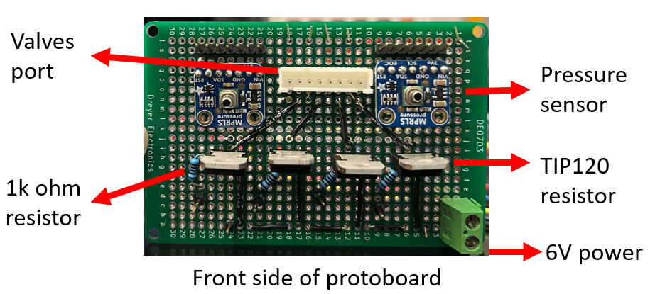
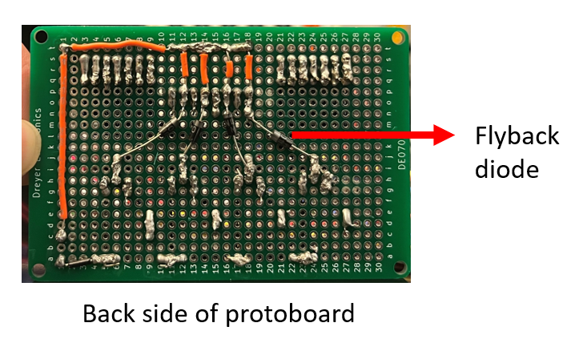

# Firmware Assembly Tutorial

This tutorial provides a step-by-step guide for soldering the custom protoboard.

---

## Raspberry Pi Cable Connection

Connect the Raspberry Pi to the VEAB board using a [Qwiic I2C 4-pin cable](https://www.adafruit.com/product/4209):
- **3.3V** → Red cable 
- **GPIO 2** → Blue cable
- **GPIO 3** → Yellow cable
- **GND** → Black cable

Connect the Raspberry Pi to one protoboard through **GPIO 17, 27, 22, and 23**.

  

---

## Arduino Cable Connection

Connect the Arduino Uno to the PCA9548A board using a [Qwiic I2C 4-pin cable](https://www.adafruit.com/product/4209):
- **3.3V** → Red cable
- **D19** → Blue cable
- **D18** → Yellow cable
- **GND** → Black cable

Connect the PCA9548A board to four protoboards using the same type of cable for **8 pressure sensors**.

Connect the Arduino to three protoboards through **D13 to D2**.

  

---

## Front View of the Protoboard

  

---

## Back View of the Protoboard

  

