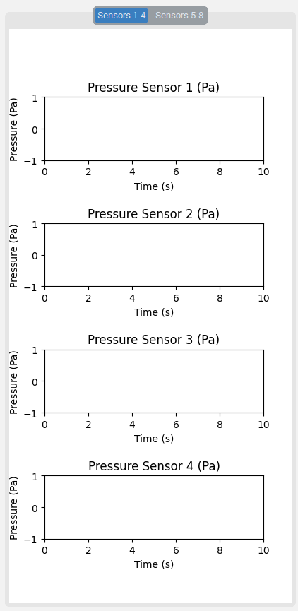

# GUI Tutorial

This tutorial provides a step-by-step guide for setting up and using the Graphical User Interface (GUI) developed in **CustomTkinter** for controlling the high-resolution tactile array. The GUI is divided into four main panels—**Setting Panel**, **Pressure Regulator Panel**, **Display Panel**, and **Sensor Panel**—each with distinct functionalities. Follow the steps below to learn how to configure connections, fine-tune system parameters, and visualize sensor data.  

---

## Prerequisites

Before launching the GUI, ensure:

- You have a **Raspberry Pi** set up with the required IP address or hostname.  
- All **hardware connections** (power, solenoid valves, sensors, etc.) are properly assembled and verified.  
- The **required Python libraries** (including [CustomTkinter](https://github.com/TomSchimansky/CustomTkinter)) are installed on the controlling computer.  
- The **network connection** between your computer and the Raspberry Pi is functioning correctly.  

---

## Step 1: Launch the GUI

1. **Open a terminal** or **command prompt** on your controlling computer.  
2. Navigate to the directory containing the GUI code (e.g., `Soft-Haptic-Display-Toolkit/Software/`).  
3. **Run the main GUI script** (e.g., `main.py`).  

  

After a brief loading period, the main GUI window will appear.  

---

## Step 2: Configure the Setting Panel

The **Setting Panel** is your starting point for system setup, network connections, and data logging options.  

1. By default, **Setting Panel** appears in the **left** section of the GUI.
2. **Connect to the Raspberry Pi**:  
   - Click the **Connect** button.  
   - Enter the **IP address** of the Raspberry Pi in the pop-up window.  
   - Confirm the connection to establish communication.  
3. **Restore Default Settings**:  
   - If needed, click **Reset** button to reset the system to its initial configuration.  
4. **Save Data**:  
   - Enable the **Save to CSV** options if you want to **record actuator commands** and **pressure sensor data** with time stamps.  
5. **Switch Themes & Scale**:  
   - Choose **Light** or **Dark** mode.  
   - Adjust the **Scale** between **80%–120%** to suit your display.  

  

> **Tip**: The Setting Panel is designed for **quick adjustments** and **record-keeping**. Always confirm the Raspberry Pi connection is successful before proceeding.

---

## Step 3: Adjust Pressure in the Pressure Regulator Panel

The **Pressure Regulator Panel** allows you to **control and visualize** the internal pressure of the tactile array. It typically appears on the **top-right** or **right** side of the GUI window.

1. **Real-Time Plot**:  
   - Observe the real-time plot on the **left** side, which shows the **normalized control signal** over time. This represents how the voltage to the regulator changes dynamically.
2. **Select Waveforms**:  
   - In the **middle** section, choose from **Sinusoidal**, **Square**, **Constant**, or **Custom-Imported** waveforms to control air pressure.  
   - **Constant** is useful for maintaining a **uniform pressure** for stable force output.
3. **Tune Parameters**:  
   - On the **right** side, you can adjust **amplitude** (for sinusoidal, square, and constant waveforms) and **frequency** (for sinusoidal and square waves).  
   - Use the **slider** or **direct text-entry** fields for precise control.

  

> **Note**: If you choose a **custom waveform**, ensure that the imported file is properly formatted (e.g., CSV or text file) and that the amplitude/frequency values are within safe limits for your hardware.

---

## Step 4: Operate the Display Panel

The **Display Panel** provides **real-time feedback**, controls for **individual valves**, and an **auto-animation** feature.

1. **Log Window** (left side):  
   - Monitor **user inputs** and **system messages**. Use these logs for **troubleshooting** and **traceability**.
2. **Additional Windows** (middle section):  
   - Use the **Training** button or **Experiment** buttons to display **12 static patterns** and **12 animation patterns**.
3. **Valve Controls** (right side):  
   - There are **16 toggle buttons**, each corresponding to one of the array’s valves.  
   - Click to **activate** or **deactivate** each channel to create **custom patterns**.
4. **Auto Tab**:  
   - Access **preprogrammed animation sequences** for demonstrations or quick testing.  
5. **Help Command** (bottom):  
   - Type **help** (or click a dedicated **Help** button, if available) to display a **concise tutorial** in the log window.

  
  
  

> **Tip**: Use the log window to confirm each valve’s status and quickly identify if a channel is unresponsive.

---

## Step 5: Monitor Sensors in the Sensor Panel

The **Sensor Panel** provides **live feedback** on the pressure sensor readings over time. It is essential for **diagnostics** and **performance monitoring**.

1. **Real-Time Plots**:  
   - There are **eight plots**, arranged in **two tabbed views**: Sensors **1–4** and Sensors **5–8**.  
   - Each plot shows the **pressure sensor data** in real-time, allowing you to quickly spot any irregularities.
2. **Tabs for Organization**:  
   - Click between the **tabs** to switch from **Sensors 1–4** to **Sensors 5–8**.  
   - This modular layout can be expanded if you have **more than eight sensors** in your setup.
3. **Troubleshooting**:  
   - Watch for **unexpected spikes** or **flat lines** in the sensor data.  
   - Irregularities may indicate **leaks**, **blockages**, or **pressure inconsistencies** in the system.

  

> **Note**: If the sensors are not displaying data, confirm that the **sensor connections** are secure and that the **I²C** or other communication protocols are configured correctly.

---

## Step 6: Review and Logging Best Practices

- **Verify** your pressure control and sensor readings frequently, especially when changing waveforms or switching valves.  
- **Enable CSV logging** in the Setting Panel to **record** system parameters and sensor data for **post-experiment analysis**.  
- Keep **notes** on any custom waveforms or animations you add for easier **collaboration** with other team members.

---

## Summary

With this GUI, you can:

- **Connect** to the tactile array system and **configure** its settings.  
- **Adjust** internal pressure using various waveforms.  
- **Control** individual valves or run **automated** activation sequences.  
- **Visualize** and **log** sensor data in real-time for immediate feedback and future review.

For more details on hardware and firmware configurations, refer to the other tutorials in this repository:
- [Hardware Assembly Tutorial](Hardware_tutorial.md)  
- [Firmware Tutorial](Firmware_tutorial.md)

Feel free to **customize** the GUI code to suit specific research needs or **expand** it with additional features (e.g., more sensors, advanced animations).  

---

> **Need More Help?**  
> Consult the **help** command within the GUI or contact the project maintainers for troubleshooting steps and in-depth assistance.  

