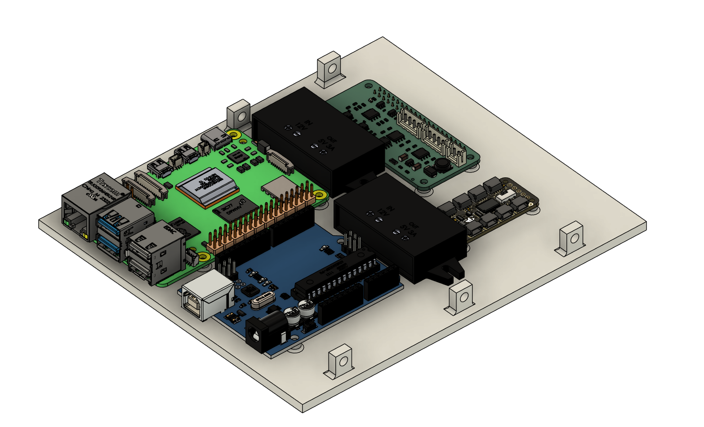
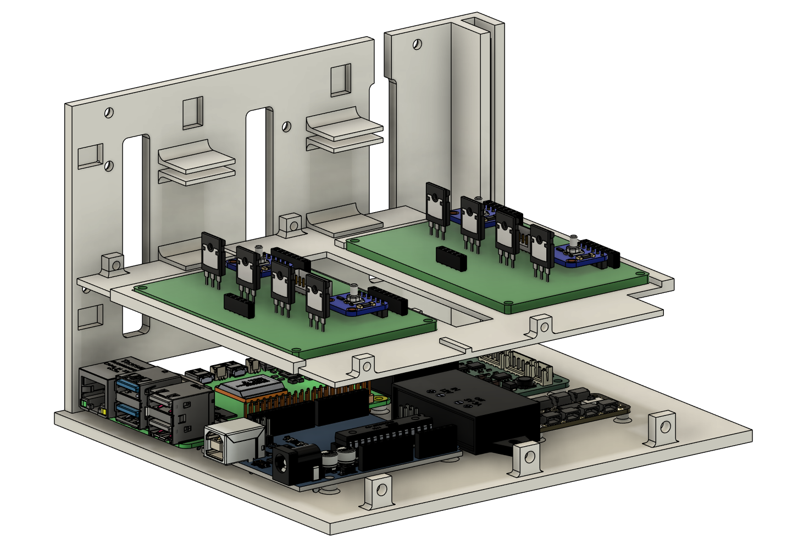
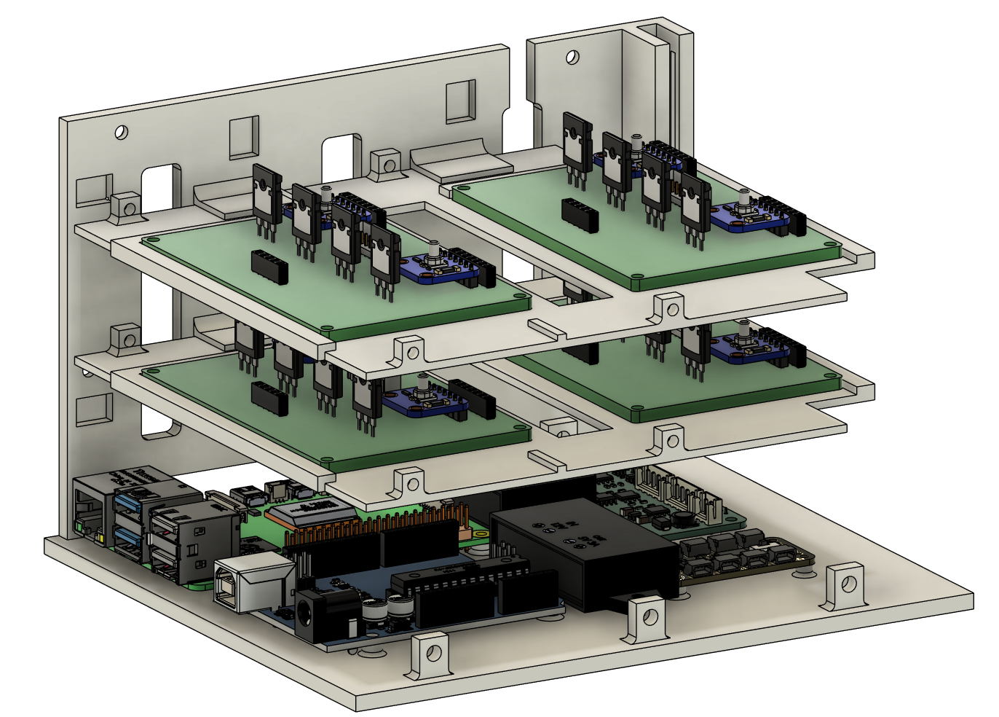
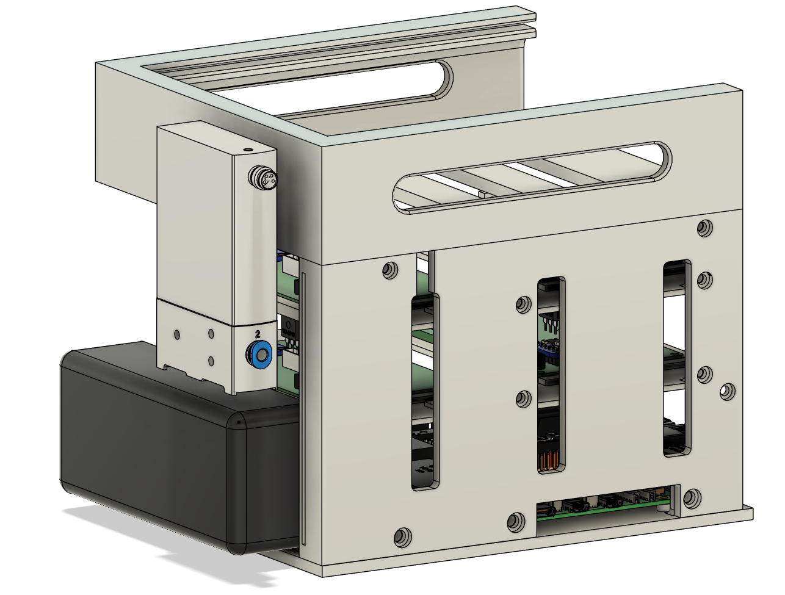
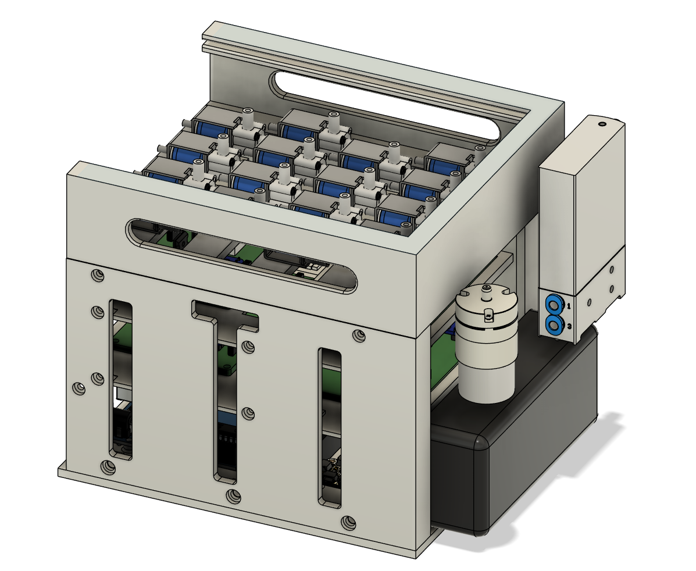
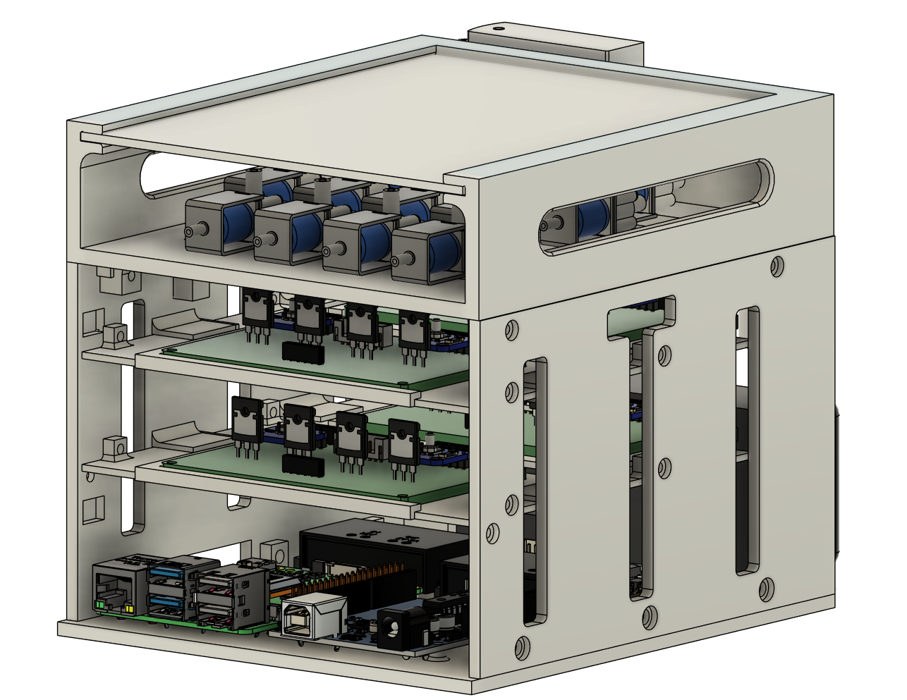

# Hardware Assembly Tutorial

This tutorial provides a step-by-step guide for assembling the control box. Before starting the assembly, ensure the following:

- Use a **3D printer** to print all **6** step files located in `Hardware/CAD`.
- Gather all the required components from the [List of Controller](../../Hardware/Bill%20of%20Materials/list%20of%20Controller.md).
- Prepare all **4 custom protoboards** by following the instructions in [Firmware Tutorial](Firmware_tutorial.md).

---

## Step 1: Assemble the Bottom Layer

Use a screwdriver to secure the following components to the **base 3D-printed board**:
- Raspberry Pi 5
- Arduino Uno
- 12V to 5V Type-C Converter
- 12V to 6V Converter
- VEAB Board
- PCA9548 I²C Multiplexer

  

---

## Step 2: Assemble the Middle Layer

Attach the **3D-printed wall board** to the base board. Install the **first board holder** and place **two custom protoboards** into it.

  

---

## Step 3: Continue Assembling the Middle Layer

Install the **second board holder** and insert the remaining **two custom protoboards**.

  

---

## Step 4: Assemble the Top Layer

- Insert the **power supply** at the back of the control box.
- Secure the **top roof board**.
- Use **straps** to attach the **pressure regulator** to the box.

  

---

## Step 5: Assemble the Left Layer

- Attach the **other side wall board**.
- Mount all **16 solenoid valves** onto the **top roof board**.
- Use **straps** to secure the **micro pump** to the box.

  

---

## Step 6: Attach the Lid and Finalize Assembly

Insert the **lid board** into the **top roof board** to complete the control box assembly.

  

