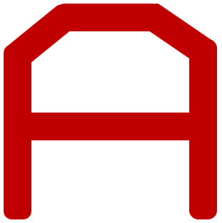
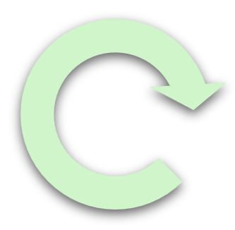
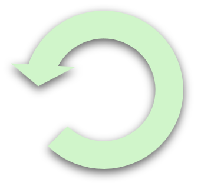
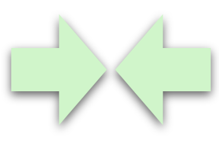
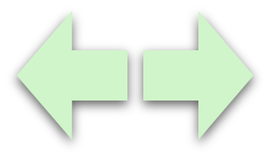
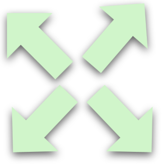

# Soft Haptic Display (SHD) Toolkit

[](./LICENSE)

A **fingertip-sized, high-resolution pneumatic haptic display** designed to provide realistic tactile feedback in virtual reality (VR) environments or during robot teleoperation. This repository includes all the **hardware** (CAD files, BOM) and **software** (Arduino, Raspberry Pi, GUI) needed to build and control the SHD.

---

## Table of Contents

- [Features](#features)
- [Screenshots](#screenshots)
- [Project Structure](#project-structure)
- [Installation](#installation)
- [Quick Start](#quick-start)
- [Documentation](#documentation)
- [Contributing](#contributing)
- [License](#license)
- [Citation & References](#citation--references)
- [Acknowledgments](#acknowledgments)

---

## Features

- **4×4 Wearable Tactile Array** – A low-cost silicone actuator array with 16 individually controlled chambers.
- **Desktop-Sized Control Box** – Integrates an Arduino Due, a Raspberry Pi, and pneumatic valves.
- **Real-Time Control** – Low-latency wireless communication between the SHD and a PC or VR platform.
- **Open-Source** – All code, CAD files, and documentation are released under the MIT license.
- **Easy to Build** – Minimal development time; accessible to students and researchers with diverse backgrounds.

---

## Screenshots

The **4 × 4 tactile array haptic display (red)** is connected to the **control box (white)** via transparent air tubes. The control box communicates with the laptop **wirelessly** using a socket communication method.

<p>
  
  
</p>


**Selected Static Patterns**
<p>
  
  
  
  
  
  
  
  
</p>


**Selected Animation Patterns**
<p>
  
  
  
</p>

<p>
  
  
  
  
</p>

<p>
  
  
  
  
  
  
</p>


---

## Project Structure

Here’s an overview of how this repository is organized:

```plaintext
Soft-haptic-display/
├── hardware/
│   ├── CAD/           # 3D/2D design files (STLs, STEP, source CAD)
│   ├── schematics/    # Electronics circuit diagrams
│   ├── BOM/           # Bill of Materials (CSV or Markdown)
├── firmware/
│   ├── arduino/       # Arduino sketches for low-level control
│   └── raspberry_pi/  # Scripts running on the Pi
├── software/
│   └── gui/           # GUI code on the Computer for controlling the SHD
├── docs/
│   ├── manual/        # User manual, assembly guide
│   ├── images/        # Animation pictures, Gif, Static pictures
├── LICENSE
├── README.md
└── CONTRIBUTING.md

```
--- 

## Installation

### Hardware Assembly

Purchase all required items from:
- [list of Controller.md](Hardware/Bill%20of%20Materials/list%20of%20Controller.md)
- [list of Pneumatic.md](Hardware/Bill%20of%20Materials/list%20of%20Pneumatic.md)
- [list of Silicone.md](Hardware/Bill%20of%20Materials/list%20of%20Silicone.md)

Follow the instructions in [Docs/Manual/hardware_assembly.md](Docs/Manual/hardware_assembly.md) to:
1. **3D-print** the mold and control box.
2. **Fabricate** the tactile array.
3. **Solder** the control board.
4. **Assemble** the entire control box and connect it to the tactile array.

---
### Install Software on Your Windows PC

1. **Fork** this repository in GitHub.
2. **Open GitHub Desktop** and clone your fork to your local machine.
3. **Open the cloned repository** in Visual Studio Code or any other Python IDE.
4. **Locate** the `main.py` file in the `soft-haptic-display/Software` directory:
   ```plaintext
   python main.py
   ```
5. Install all required Python libraries until the GUI successfully appears on your computer.

---
### Install Software on the Raspberry Pi

1. **Connect** the Raspberry Pi to a monitor.
2. **Open a terminal** on the Raspberry Pi:
```plaintext
git clone https://github.com/pijuanyu2022/Soft-Haptic-Display-Toolkit.git
cd Soft-Haptic-Display-Toolkit/Firmware/Raspberry_Pi/
```
3. **Create a virtual environment** in the terminal window:
```plaintext
python -m venv SoftRobo
source SoftRobo/bin/activate
```

4. **Install**  all required Python libraries so that `run_robot.py` can be opened correctly:
```plaintext
python run_robot.py
```

---
### Install Software on the Arduino Uno

1. **Connect** the Arduino Uno to your PC.
2. **Navigate** to the `/Firmware/Arduino/` directory and open `Pneumatic.ino` in the Arduino IDE.
3. **Select** Arduino Uno under *Tools → Board* in the Arduino IDE.
4. **Upload** the code to the Arduino Uno.

Tips: You can also install the Arduino IDE on the Raspberry Pi and use the Pi to upload the code to the Arduino Uno.

---
## Quick Start

#### 1. **Connect your PC and Raspberry Pi** to the same Wi-Fi network.

#### 2. **Find the Raspberry Pi’s IP address**:
- On the Raspberry Pi’s **Terminal**, type:
```plaintext
ifconfig
```
- Look for the `wlan0` or `eth0` section. The IP might look like `192.168.x.x`.

#### 3. **Open a Command Prompt** on your Windows PC:
- Press the **Start Menu** or **Taskbar** search, type `"cmd"`, and press Enter.

#### 4. Click Command Prompt and put
```plaintext
ssh [username]@[IP address]
```
- Example
```plaintext
ssh pi@192.168.1.100
```
- Enter the Pi’s password when prompted.

#### 5. Once connected, you should see something like:
```plaintext
pi@raspberrypi: ~ $
```
This indicates that the Command Prompt is now logged into your Raspberry Pi.

#### 6. Start the control script on the Pi:
```plaintext
cd Soft-Haptic-Display-Toolkit/Firmware/Raspberry_Pi/
source SoftRobo/bin/activate
python run_robot.py
```
- Keep this Command Prompt session open so the script keeps running.

#### 7. On your Windows PC, open Visual Studio Code (or another Python IDE):
- Navigate to the cloned repository folder:
```plaintext
Soft-Haptic-Display-Toolkit/Software
```
- Locate and **run** `main.py`.

#### 8. In the GUI that appears, **click the `Connect` button** (top-left corner) and **enter the Raspberry Pi’s IP address** (the same one used for SSH).

#### 9. **Follow** the [GUI Usage.md](Docs/Manual/GUI_Usage.md) for detailed steps on controlling the tactile display.
- You should now be able to **inflate** and **deflate** the soft haptic array channels in real time!

---
## Documentation
- Assembly & Fabrication: [docs/manual/hardware_assembly.md](Docs/Manual/hardware_assembly.md)
- Firmware Guides: [docs/manual/firmware_setup.md](Docs/Manual/firmware_setup.md)
- GUI Usage: [docs/manual/GUI Usage.md](Docs/Manual/GUI_Usage.md)
- Troubleshooting: [docs/Troubleshooting.md](Docs/troubleshooting.md)
- Bill of controller: [Hardware/Bill of Materials/list of Controller.md](Hardware/Bill%20of%20Materials/list%20of%20Controller.md)
- Bill of pneumatic system: [Hardware/Bill of Materials/list of Pneumatic.md](Hardware/Bill%20of%20Materials/list%20of%20Pneumatic.md)
- Bill of tactile dislay: [Hardware/Bill of Materials/list of Silicone.md](Hardware/Bill%20of%20Materials/list%20of%20Silicone.md)

For any **unresolved issues**, please file a ticket under the Issues tab.

---
## Contributing
We welcome all forms of contributions—bug reports, feature requests, code improvements, and documentation updates. To get started:
1. **Fork** this repository.
2. **Create** a new branch (e.g., feature/new-valve-driver).
3. **Commit** and **push** your changes.
4. **Open** a Pull Request describing your modifications.

---
## License
This project is licensed under the terms of the [MIT License](./LICENSE).

You are free to **use, modify, and distribute** this work as long as you include the original license and attribution to the authors.

---
## Citation & References
We are planning to submit this research to the 2025 Ubiquitous Robots Conference as a regular paper. The citation will be listed in the future.

---
## Acknowledgments
Special thanks to our collaborators and the open-source community:
- Our [Friesen Haptics Lab](https://www.friesenhaptics.com/.).
- The [INVENT Lab](https://www.theinventlab.com/).
- The [Soft Robotics Toolkit](https://softroboticstoolkit.com/) for inspiration and design references.
- The [Soft Robotics Control-unit (SRC)](https://github.com/chukhanhhoang/SoftRoboticSetupFesto?tab=readme-ov-file) for control references.